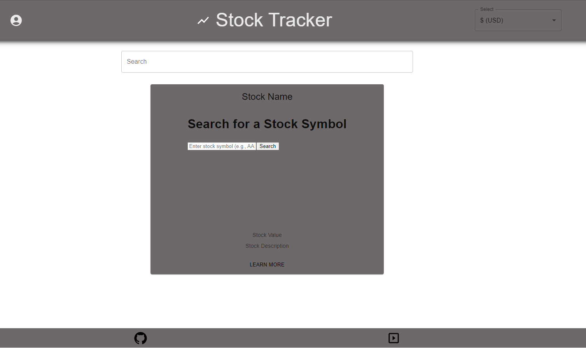

# Stock Tracker


## Overview

Welcome to our Full-Stack Project! The application allows users to search for a stock symbol (in example - AAPL for Apple Inc.) and retrieve the previous close market price for that symbol.

## Features

1) **Search Functionality:** Users can input a stock symbol into a search field.

2) **API Integration:** The application utilizes the YH Finance API from RapidAPI to fetch stock data.

3) **Data Display:** Upon entering a valid stock symbol, the application sends a request to the YH Finance API, which returns the previous close market price then displays a chart using Chart.js

4) **User Feedback:** The application provides clear feedback to users, displaying the previous close price or an error message if the symbol is not valid or if the API call fails.


## Installation

```
git clone https://github.com/haydencfb/Stock-Project.git
```
```
npm install
```

```
npm run start:dev
```

## Screenshot


## Demo

TBA

## Contributors

[Hayden Fitzpatrick-Brintle](https://github.com/haydencfb)

[John Marquez](https://github.com/jvhnn)

[John Dinh](https://github.com/jandgdinh)

[Brian Petros](https://github.com/brianleepetros)